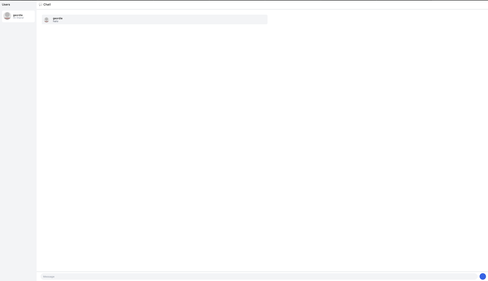
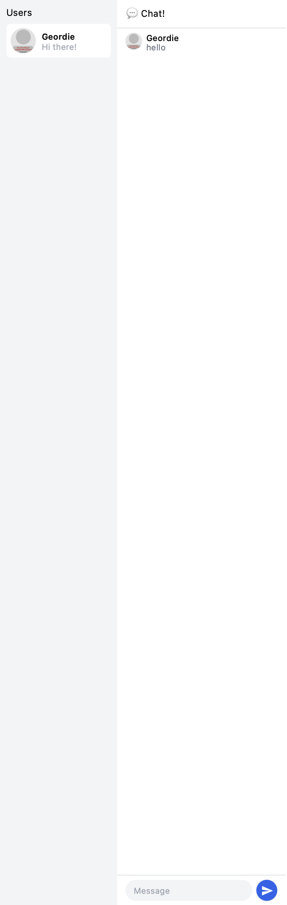

# YewChat 💬

> Source code for [Let’s Build a Websocket Chat Project With Rust and Yew 0.19 🦀](https://fsjohnny.medium.com/lets-build-a-websockets-project-with-rust-and-yew-0-19-60720367399f)

## Install

1. Install the required toolchain dependencies:
   ```npm i```

2. Follow the YewChat post!

## Branches

This repository is divided to branches that correspond to the blog post sections:

* main - The starter code.
* routing - The code at the end of the Routing section.
* components-part1 - The code at the end of the Components-Phase 1 section.
* websockets - The code at the end of the Hello Websockets! section.
* components-part2 - The code at the end of the Components-Phase 2 section.
* websockets-part2 - The code at the end of the WebSockets-Phase 2 section.


# Original code




# Be Creative!



I refactored the entire view method by breaking it into semantic sections—wrapping the users list in an <aside>, the chat area in <main>, and further dividing that into <header>, <section>, and <footer> so the structure is clearer. I replaced the raw if inside the message rendering with a proper { if … { html!{…} } else { html!{…} } } block so it compiles without errors. To simplify the code, I swapped the old .map().collect::<Html>() calls for the more concise for … in iteration. I also cleaned up the Tailwind classes using min-h-screen instead of forcing h-screen, correcting text-white and fill-current for SVG coloring, and tidying spacing utilities—so the styling renders correctly and the markup is easier to read and maintain.